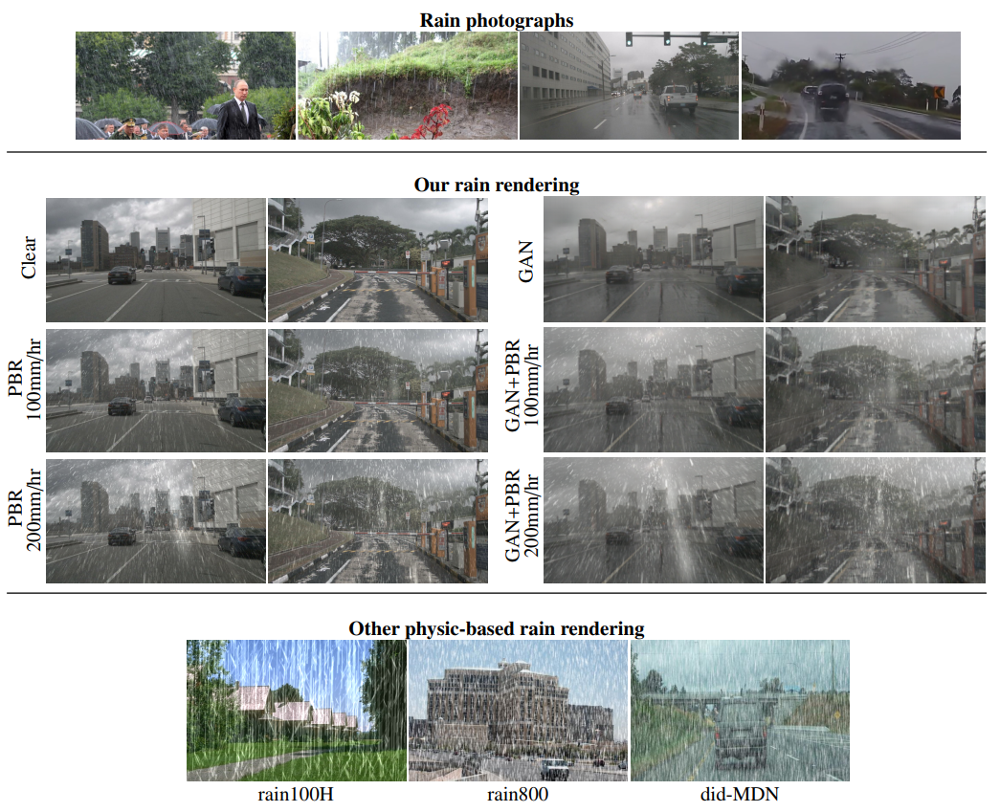

# Rain Rendering for Evaluating and Improving Robustness to Bad Weather

Official repository.  
This code is to augment clear weather images with controllable amount of rain using our physics-based rendering. It allows evaluating/training algorithms, improving robustness to rain, detecting/removing rain, etc.

We provide rain-augmented datasets in the [dataset zoo](#dataset-zoo).

## Paper 



<!--
Physic-based rain (PBR) pipeline:


GAN+PBR pipeline: 


//-->

[Rain Rendering for Evaluating and Improving Robustness to Bad Weather](https://arxiv.org/abs/2009.03683) \
[Maxime Tremblay](http://vision.gel.ulaval.ca/en/people/Id_637/index.php), [Shirsendu S. Halder](https://scholar.google.com/citations?user=A_e7SA8AAAAJ), [Raoul de Charette](https://team.inria.fr/rits/membres/raoul-de-charette/), [Jean-François Lalonde](http://vision.gel.ulaval.ca/~jflalonde/)  
Inria, Université Laval. IJCV 2020

If you find our work useful, please cite:
```
@article{tremblay2020rain,
  title={Rain Rendering for Evaluating and Improving Robustness to Bad Weather},
  author={Tremblay, Maxime and Halder, Shirsendu S. and de Charette, Raoul and Lalonde, Jean-François},
  journal={International Journal of Computer Vision},
  year={2020}
}
```
This works is accepted at IJCV 2020 ([preprint](https://arxiv.org/abs/2009.03683)) and is an extension of our [ICCV'19 paper](https://arxiv.org/abs/1908.10335).


## Preparation

Tested on both Linux & Windows with
* Python 3.6
* OpenCV 3.2.0
* PyClipper 1.0.6
* Numpy 1.18

### Setup

Create your conda virtual environment:
```sh
conda create --name py36_weatheraugment python=3.6 opencv numpy matplotlib tqdm imageio pillow natsort glob2 scipy scikit-learn scikit-image pexpect -y

conda activate py36_weatheraugment

pip install pyclipper imutils
```

Our code relies on kindly shared third parties researches. Specifically, we use the particles simulator of ([de Charette et al., ICCP 2012](https://github.com/cv-rits/weather-particle-simulator)), and the rainstreak illumination database of ([Garg and Nayar, TOG 2006](https://cave.cs.columbia.edu/projects/categories/project?cid=Physics-Based+Vision&pid=Photorealistic+Rendering+of+Rain+Streaks)).
To install all third parties:
* Download the Columbia Uni. [rain streak database](https://cave.cs.columbia.edu/old/databases/rain_streak_db/databases.zip) \[[backup link](https://web.archive.org/web/20240820054544/https://www.cs.columbia.edu/CAVE/databases/rain_streak_db/databases.zip)\]and extract files in `3rdparty/rainstreakdb`
* **\[Optional, cf. below\]** Install the CMU [weather particle simulator](https://github.com/cv-rits/weather-particle-simulator) with 
`git submodule update --init` and follow "setup" instructions in `3rdparty/weather-particle-simulator/readme.md` to ensure dependencies are resolved.

Note that without the weather particle simulator, you will only be able to run our rendering using our pre-computed particles simulation on a few datasets. Cf. [dataset zoo](#dataset-zoo).

## Running the code
The renderer augment sequences of images with rain, using the following required data:
- images
- depth maps
- calibration files (optional, KITTI format)
- particles simulation files (optional, otherwise files are automatically generated by the "weather particle simulator")

File structure may vary per dataset, but a typical structure is:
```sh
data/source/DATASET/SEQUENCE/rgb/file0001.png           # Source images (color, 8 bits)
data/source/DATASET/SEQUENCE/depth/file0001.png         # Depth images (16 bits, with depth_in_meter = depth/256.)
```

Particles simulation files are located (or automatically generated) in:
```sh
data/particles/DATASET/XXXX/rain/10mm/*.xml         # Particles simulation files (here, 10mm/hr rain)
```

Upon success, the renderer will output:
```sh
data/output/DATASET/SEQUENCE/rain/10mm/rainy_image/file0001.png     # Rainy images (here, 10mm/hr rain)
data/output/DATASET/SEQUENCE/rain/10mm/rainy_mask/file0001.png      # Rainy masks (int32 showing rain drops opacity, useful for rain detection/removal works) 
data/output/DATASET/SEQUENCE/envmap/file0001.png                    # Estimated environment maps (only output with --save_envmap)
```

We provide guidance and all required files to generate rain on [KITTI](http://www.cvlibs.net/datasets/kitti), [Cityscapes](https://www.cityscapes-dataset.com), [nuScenes](https://www.nuscenes.org).
You may refer to the custom section below to render rain on your own images.


### Rendering rain on KITTI, Cityscapes, nuScenes

_Notes: For ready-to-use rainy versions of KITTI/Cityscapes/nuScenes, refer to the [dataset zoo](#dataset-zoo). The following instructions is for re-generating your own rainy images._

#### KITTI
To generate rain on the [2D object subset of KITTI](http://www.cvlibs.net/datasets/kitti/eval_object.php?obj_benchmark=2d), download "left color images of object data set" from [here](http://www.cvlibs.net/download.php?file=data_object_image_2.zip), "camera calibration matrices of object data set" from [here](http://www.cvlibs.net/download.php?file=data_object_calib.zip), and our depth files from [here](https://www.rocq.inria.fr/rits_files/download.php?file=computer-vision/weather-augment/weather_kitti_data_object_training_image_2_depth.zip).
Extract all in `data/source/kitti/data_object`.

You should consider downloading pre-computed KITTI particles simulations from [here](https://www.rocq.inria.fr/rits_files/download.php?file=computer-vision/weather-augment/weather_kitti_data_object_particles.zip) and extract files in `data/particles/kitti`. (This is mandatory if particles simulator is not set up)

Verify that the following files exist `data/source/kitti/data_object/training/image_2/000000.png`, `data/source/kitti/data_object/training/image_2/depth/000000.png`, `data/source/kitti/data_object/training/calib/000000.txt` and `data/particles/kitti/data_object/rain/25mm/` (if you downloaded particles files). Adjust your file structure if needed.

To generate rain of 25mm/hr fall rate on the first 10 frames of each sequence of KITTI, run:  
```sh
python main.py --dataset kitti --intensity 25 --frame_end 10
```

Output will be located in `data/output/kitti`. Drop the `frame_end` argument to render the full rainy dataset or refer to the [Advanced usage](#advanced-usage) for more examples. 

\[We provide all required data for KITTI sequences: `data_object/training`, `raw_data/2011_09_26/2011_09_26_drive_0032_sync`, `raw_data/2011_09_26/2011_09_26_drive_0056_sync`\]


#### Cityscapes

Download the "leftImg8bit" dataset from [here](https://www.cityscapes-dataset.com/downloads/), and our depth files from [here](https://www.rocq.inria.fr/rits_files/download.php?file=computer-vision/weather-augment/weather_cityscapes_leftImg8bit_train_depth.zip).
Extract all in `data/source/cityscapes`.

You should also consider downloading Cityscapes pre-computed particles simulations from [here](https://www.rocq.inria.fr/rits_files/download.php?file=computer-vision/weather-augment/weather_cityscapes_particles.zip) and extract files in `data/particles/cityscapes`. (This is mandatory if particles simulator is not set up)

Verify that the following files exist: `data/source/cityscapes/leftImg8bit/train/aachen/aachen_000000_000019_leftImg8bit.png`, `data/source/cityscapes/leftImg8bit/train/depth/aachen/aachen_000000_000019_leftImg8bit.png` and `/data/particles/cityscapes/leftImg8bit/rain/25mm/` (if you downloaded particles files). Adjust your file structure if needed.

To generate rain of 25mm/hr fall rate on the first 2 frames of each sequence of Cityscapes, run:  
`python main.py --dataset cityscapes --intensity 25 --frame_end 2`  
Alternatively you can render only one sequence, for example with:  
`python main.py --dataset cityscapes --sequences leftImg8bit/train/aachen --intensity 25 --frame_end 10`

Output will be located in `data/output/cityscapes`. Drop the `frame_end` argument to render the full rainy dataset or refer to the [Advanced usage](#advanced-usage) for more examples.

#### nuScenes (coming up)

Recent updates broke nuScenes compatibility, this will be resolved soon. Stay tuned.
To run our rendering on your custom dataset, you must provide a configuration file. Configuration files are stored in config/ and must be named after the dataset.


<!--
**Prerequisite**  
Note that nuScenes requires installing [nuscenes-devkit](https://github.com/nutonomy/nuscenes-devkit) which may be done with:
```
pip install nuscenes-devkit
```

Please download the full dataset (v1.0) from the [nuScenes](https://www.nuscenes.org/download) website and extract it.

For our experiments on nuScenes, we did not use all the images from all the camera sensors. We only used images in `samples/CAM_FRONT`, i.e. key frames in the scene which have annotations that were captured by the front camera.

We have made different splits from those images; we've separated rain from clear and removed all the night images. There are train and test images for both of these categories. The split files are in the [config/nuscenes/splits](config/nuscenes/splits) folder in json format.

All of the json files have contains the `sample_data_tokens` key which provide a list of tokens that each points toward a specific `sample_data` in the nuScenes dataset. This is all handled by our dataset wrapper in `nusc_dataset.py`.  

#### nuScenes-GAN

As mentioned in fig. 5 of the paper (see GAN+PBR pipeline), our GAN+PBR approach is straightforward and only requires translated images from clear to rain using a GAN-based approach such as [CycleGAN](https://github.com/junyanz/pytorch-CycleGAN-and-pix2pix). 

If you want to test our GAN+PBR approach on nuScenes you will need clear-rain translated images (such as in our [dataset zoo](#dataset-zoo) as well as the metadata from nuScenes. The folder organisation of the GAN augmented data should be exactly the same as the organisation in the nuScenes folder (same subfolders and same filenames).

The same split files can be used for augmenting nuScenes-GAN images than for regular nuScenes.   
//-->

### Rendering rain on custom images

Rendering rain on any custom images is easy but requires some preparation time.  

### Preparation
The code requires your data to be organized in _dataset_ (root folder) with _sequences_ (subfolders). Let's assume you have:
```sh
data/source/DATASET/SEQUENCE/rgb/xxx.png           # Source images (color, 8 bits)
data/source/DATASET/SEQUENCE/depth/xxx.png         # Depth images (16 bits, with depth_in_meter = depth/256.)
```
(_optionally_ intrinsic calib files can be provided, in KITTI format.)

To run our rendering on your custom dataset, you must provide a configuration file. Configuration files are stored in `config/` and must be named after the dataset.

The dataset configuration file should expose two functions: 
* `resolve_paths(params)` which updates and returns the `params` dictionary with paths params.images\[sequence\], params.depth\[sequence\], params.calib\[sequence\] the sequence dictionary paths to images/depth/calib data for _all_ sequences of the dataset.
* `settings()` which returns a dictionary with dataset settings (and optionally sequence-wise settings).
 
Here is a sample configuration file `config/customdb.py`:
```python
import os
def resolve_paths(params):
    # List sequences path (relative to dataset folder)
    # Let's just consider any subfolder is a sequence
    params.sequences = [x for x in os.listdir(params.images_root) if os.path.isdir(os.path.join(params.images_root, x))]
    assert (len(params.sequences) > 0), "There are no valid sequences folder in the dataset root"

    # Set source image directory
    params.images = {s: os.path.join(params.dataset_root, s, 'rgb') for s in params.sequences}

    # Set calibration (Kitti format) directory IF ANY (optional)
    params.calib = {s: None for s in params.sequences}

    # Set depth directory
    params.depth = {s: os.path.join(params.dataset_root, s, 'depth') for s in params.sequences}

    return params

def settings():
    settings = {}

    # Camera intrinsic parameters
    settings["cam_hz"] = 10               # Camera Hz (aka FPS)
    settings["cam_CCD_WH"] = [1242, 375]  # Camera CDD Width and Height (pixels)
    settings["cam_CCD_pixsize"] = 4.65    # Camera CDD pixel size (micro meters)
    settings["cam_WH"] = [1242, 375]      # Camera image Width and Height (pixels)
    settings["cam_focal"] = 6             # Focal length (mm)
    settings["cam_gain"] = 20             # Camera gain
    settings["cam_f_number"] = 6.0        # F-Number
    settings["cam_focus_plane"] = 6.0     # Focus plane (meter)
    settings["cam_exposure"] = 2          # Camera exposure (ms)

    # Camera extrinsic parameters (right-handed coordinate system)
    settings["cam_pos"] = [1.5, 1.5, 0.3]     # Camera pos (meter)
    settings["cam_lookat"] = [1.5, 1.5, -1.]  # Camera look at vector (meter)
    settings["cam_up"] = [0., 1., 0.]         # Camera up vector (meter)

    # Sequence-wise settings
    settings["sequences"] = {}
    settings["sequences"]["seq1"] = {}
    settings["sequences"]["seq1"]["sim_mode"] = "normal"
    settings["sequences"]["seq1"]["sim_duration"] = 10  # Duration of the rain simulation (sec)

    return settings
```
The `resolve_paths(params)` function parses the dataset root folder (here, `data/source/customdb`) to discover sequences (any subfolder) and assign images/depth/calib path for each sequence. For each sequence in this example, images are located in `rgb`, depth maps are in `depth`, and calib files are not provided (i.e. `None`).  

Of importance here, `settings["sequences"]` is a sequence-wise dictionary, which _keys_ may be any relative path to a sequence or a group of sequences. 
Note that sequences inherit dataset settings.  
Sequences-wise parameters allow defining custom parameters for the simulation. 
In above example, this will simulate a rain event of 10 seconds. 
To ensure temporal consistency, continuous frame use continuous simulation steps.

Simulations can have fancy settings, such as camera motion speed (e.g. to mimic a vehicle motion), varying rain fall rates (e.g. to mimic rain of different intensity), changing focals/exposure, etc...
You may refer to sample config files in `config/`.

### Running

Once data and config are prepared, you may run the rendering with:  
`python main.py --dataset customdb --intensity 25 --frame_end 10`  (replace "**customdb**" with your dataset name)

Output will be located in `data/output/customdb`.

#### Notes
* Particles simulations will be automatically generated on first run and won't be re-generated again. However, _some_ settings `config/DATASET.py` may affect the physical simulator (e.g. camera focal _does_, camera gain _does not_).  You may need to use the parameter `--force_particles` to ensure re-running particles simulation if you changed some parameters.
* If depth maps are smaller than images, we crop center images to match depth maps (i.e. we assume depth had some padding).

## Advanced usage

You can generate multiple rain fall rate at once if you provide comma separated intensities. For example,   
`python main.py --dataset kitti --intensity 1,5,10,20`  renders rain on all sequences of KITTI at 1, 5, 10, 20mm/hr

You can generate rain on multiple sequences using comma separated sequences. For example,  
`python main.py --dataset cityscapes --sequence leftImg8bit/train/aachen,leftImg8bit/train/bochum  --intensity 10,20`  renders 10mm and 20mm rain on _aachen_ and _bochum_ sequences only

You can control which part of the sequence is rendered with, `--frame_*` parameters. For example,  
`python main.py --dataset kitti --intensity 1,5 --frame_start 5 --frame_end 25`  generates rain on frames 5-25 from each sequence  
`python main.py --dataset kitti --intensity 1,5 --frame_step 100`  generates every 100 other frames of all sequences (extremely useful for quick overview of a sequence)

#### Multi threads rendering  
Rain rendering is quite long. You can use multithread rendering which significantly speeds up. For example,  
`python main_threaded.py --dataset kitti --intensity 1,5,10,20,30 --frame_start 0 --frame_end 8`  (note all arguments are automatically passed to each main.py thread)

**Known limitation:** there might be some conflicts if multiple renderers while threaded start the particles simulator. Hence, ensure particle simulation files are ready prior to the multi-threaded rendering. 

#### Particles simulator
Particles simulations can be computed in a multi-thread manner, separate from our renderer. To do so, edit bottom lines of `tools/particles_simulation.py` and run:  
`python tools/particles_simulation.py` 

## Dataset zoo

### Rainy versions of KITTI, Cityscapes, nuScenes

To download the rainy versions of the datasets, please visit our [ICCV'19 paper website](https://team.inria.fr/rits/computer-vision/weather-augment/).  

### Data to generate rain on KITTI, Cityscapes, nuScenes

Here, we gather the direct links to download required data to generate rain on popular datasets.

| Data          | Kitti (Object detection)         | Kitti (Raw data)         | Cityscapes  | nuScenes | 
| ------------- | :-----------: | :-----------: | :---------: | :------: |
| Images        | [link](http://www.cvlibs.net/download.php?file=data_object_image_2.zip)  | seq 0032 [link](https://s3.eu-central-1.amazonaws.com/avg-kitti/raw_data/2011_09_26_drive_0032/2011_09_26_drive_0032_sync.zip) <br> seq 0056 [link](https://s3.eu-central-1.amazonaws.com/avg-kitti/raw_data/2011_09_26_drive_0056/2011_09_26_drive_0056_sync.zip)  | "leftImg8bit" from [link](https://www.cityscapes-dataset.com/downloads/)    | coming up |
| Depth         | [link](https://www.rocq.inria.fr/rits_files/download.php?file=computer-vision/weather-augment/weather_kitti_data_object_training_image_2_depth.zip)  | seq 0032 [link](https://www.rocq.inria.fr/rits_files/download.php?file=computer-vision/weather-augment/weather_kitti_raw_data_2011_09_26_2011_09_26_drive_0032_sync_image_02_data_depth.zip) <br> seq 0056 [link](https://www.rocq.inria.fr/rits_files/download.php?file=computer-vision/weather-augment/weather_kitti_raw_data_2011_09_26_2011_09_26_drive_0056_sync_image_02_data_depth.zip)  | [link](https://www.rocq.inria.fr/rits_files/download.php?file=computer-vision/weather-augment/weather_cityscapes_leftImg8bit_train_depth.zip)    | coming up |
| Calibration   | [link](http://www.cvlibs.net/download.php?file=data_object_calib.zip)  | _included in images_  | - | - |
| Particles*    | [link](https://www.rocq.inria.fr/rits_files/download.php?file=computer-vision/weather-augment/weather_kitti_data_object_particles.zip)| seq 0032 [link](https://www.rocq.inria.fr/rits_files/download.php?file=computer-vision/weather-augment/weather_kitti_raw_data_2011_09_26_2011_09_26_drive_0032_sync_particles.zip) <br> seq 0056 [link](https://www.rocq.inria.fr/rits_files/download.php?file=computer-vision/weather-augment/weather_kitti_raw_data_2011_09_26_2011_09_26_drive_0056_sync_particles.zip)  | [link](https://www.rocq.inria.fr/rits_files/download.php?file=computer-vision/weather-augment/weather_cityscapes_particles.zip)    | coming up |


\* For each sequence, we provide 38 rain physical simulations at: 1, 2, 3, ..., 10, 15, 20, ..., 100, 110, 120, ..., 200mm/hr. This prevents re-running physical simulations (which is long). If you do so, extract files in `data/particles/DATABASE`. When running the renderer, if files are correctly located "All particles simulations ready" should print in the log.
<!--
##### Additional data
This [~~link~~]() points to the 50 hand made semantic segmentation for nuScenes. 

## Computer vision tasks robustness to bad weather improvement

Using the preceding datasets, we finetuned various network to improve the performance in bad weather. More details are available in the paper, but here is a figure with various results on real rain with a rain-aware YOLOv2 network.


//-->

### License

The code is released under the [Apache 2.0 license](./LICENSE).  
The data in the dataset zoo are released under the [Creative Commons Attribution-NonCommercial-ShareAlike 3.0](https://creativecommons.org/licenses/by-nc-sa/3.0/).
